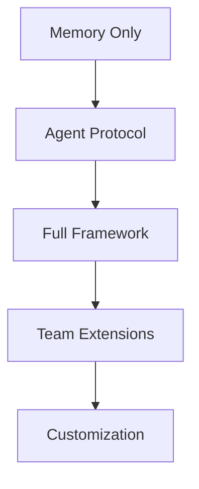

# DOC-2: Learning Roadmap

**Priority:** P0
**Agent:** @agent-doc
**Status:** Not Started
**Depends On:** None

---

## Description

Create a comprehensive learning roadmap that guides users from beginner to advanced, with multiple entry points based on available time. Model after claude-howto's LEARNING-ROADMAP.md.

## Acceptance Criteria

- [ ] 5 milestones with clear progression
- [ ] Multiple quick-start paths (15 min, 1 hour, weekend)
- [ ] Success criteria for each milestone
- [ ] Mermaid diagram showing learning flow
- [ ] Hands-on exercises for each section
- [ ] Progress tracking checklist

## Reference

Study: `/docs/claude-howto-reference/LEARNING-ROADMAP.md`

## Output

File: `/docs/LEARNING-ROADMAP.md`

---

## Subtasks

### DOC-2.1: Define Milestones
**Agent:** @agent-doc

Create 5 milestones:
1. **Essential Start** - Memory + /continue (15 min)
2. **Agent Workflow** - Protocol + basic agents (45 min)
3. **Full Framework** - All agents + skills (2 hours)
4. **Team Setup** - Extensions + knowledge repos (1 hour)
5. **Power User** - Custom agents + private skills (2 hours)

### DOC-2.2: Create Mermaid Diagram
**Agent:** @agent-doc

Visual learning path:

### DOC-2.3: Quick Start Paths
**Agent:** @agent-doc

Three entry points:
- **15 Minutes**: Memory only, /continue works
- **1 Hour**: Memory + Protocol + 3 main agents
- **Weekend**: Full framework + team setup

### DOC-2.4: Hands-on Exercises
**Agent:** @agent-doc

For each milestone:
- Copy-paste ready commands
- Expected outcomes
- "Try it now" prompts
- Verification steps

### DOC-2.5: Progress Checklist
**Agent:** @agent-doc

Checkbox format:
- [ ] Milestone 1 complete
  - [ ] Memory installed
  - [ ] /continue works
  - [ ] First initiative created
- [ ] Milestone 2 complete
  - etc.

### DOC-2.6: Success Criteria
**Agent:** @agent-doc

For each milestone, define:
- What you can do now
- What you should understand
- When to move to next milestone

---

## Implementation Notes

- Use claude-howto's structure but adapt for our 4 pillars
- Focus on value delivered at each stage
- Make progression feel natural, not forced
- Include "skip to here" links for experienced users
